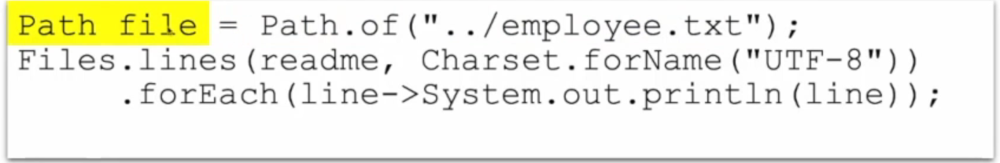

### Voltar para o [README.md](./README.md)

java API's são uma forma mais eficiente de filtrar, mapear, reduzir e aumentar fluxos de dados, e eles fazem isso usando **LAMBDA**

> Dica: OMDb API
> ao usar uma api, é preciso concatenar as informações, e pra isso existem algumas aplicações tipo o postman
> precisa fazer uma http request
> precisa pegar um gson de maven pra organizar os dados (https://mvnrepository.com) > no caso estamos usando o gson:https://mvnrepository.com/artifact/com.google.code.gson/gson e https://google.github.io/gson/UserGuide.html  

array é um grupo simples de elementos onde cada elemento tem um index diferentes

> temos também ArrayList, LinkedList, Set, Stack, Queue!!  

Bibliotecas != frameworks:  Bibliotecas são funcionalidades prontas para uso, em JAR, e contém classes e demais recursos, podem ser importadas em projetos e usadas diretamente em código pra funcionalidades específicas. Frameworks são estruturas de arquitetura básica para desenvolvimento de aplicações, e podem incluir bibliotecas e práticas recomendadas pro desenvolvimento. (como se fosse uma fábrica de aplicações + conjunto de regras pra fazer isso)

WEB SERVICES > trabalhar com mapeamentos, conversão de objetos 
em qualquer transporte, JAXB ou JAXP => XML e vice-versa (são literalmente as funções de ligação e processamento dentre XML e JAVA)

no HTTP, os objetos podem ser colocados, apagados, postados e pegos dentre o java e a mensagem colocada (podendo estar em texto, JavaScript Object Notation e XML).

jAVA EE (ENTERPRISE) faz o host com segurança, concorrencia, gerenciamento e tal

## Padrões de projeto:
criação: lidam com a criações de objeto, procurando garantir flexibilidade e reutilização (Factory Method, Builder, Singleton)  
estrutura: lidam com a organização de objetos buscando simplificar a comunicação entre eles (Adapter, Facade, Composite)  
comportamento: lidam com a comunidação entre objetos, querendo definir comportamentos específicos em situações específicas (Observer, Command e Strategy)  

