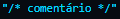
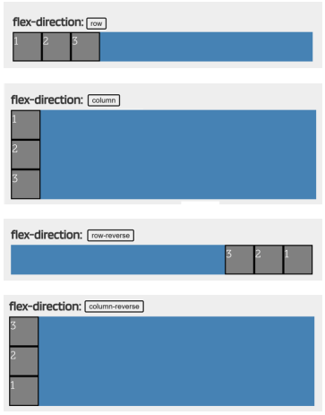
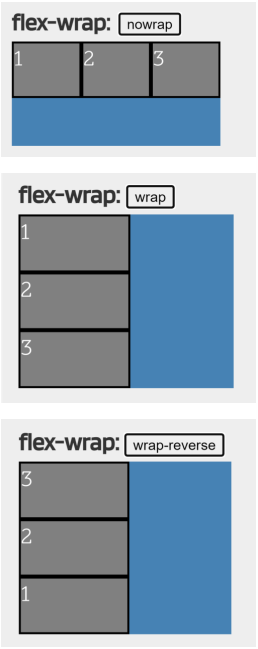

### Voltar para o [README.md](./README.md)  
[modelo caixa container](#modelo-caixa-container)  
[float, margin e padding](#float-margin-e-padding)  
[selecionadores](#selecionadores)  
[cores](#cores)  
[estilos para links](#estilos-para-links)  
[unidades](#unidades)  
[CSS FLEXBOX](#css-flexbox)  
[flex e wrap](#flex-e-wrap)  
[alinhamentos](#alinhamento)  

# outros assuntos relevantes: [HTML](./WebDev.md) - [JavaScript](./javascript.md)

# CSS
Todas as etiquetas CSS são compostas por: **seletores** que determina a área a ser modificada, **instruções** que se referem às modificações aplicadas.  
    Tipos de delarações = in-line: estilo é declarado dentro da própria tag HTML;  
                interno: estilo declarado dentro de uma tag *style* criada dentro de uma head no próprio html;  
                externo: estilo é decladaro entro de um arquivo *CSS* separado, e puxado em um link para dentro do arquivo html (link rel="stylesheet" href="estilos.css").

Comentários em CSS são aceitos como:  
      

Fontes Personalizadas vêm a partir de uma propriedade @font-face com a {font-family; e o src;} que está a fonte desejada!!  
E então é só aplicar: p {font:bold 32px 'Font';} > isso fará com que a fonte **Font em Negrito** seja aplicada a todos os parágrafos da página.

### MODELO CAIXA-CONTAINER:
Etiquetas **BLOCK** (dão quebra de linha acima e abaixo de cada tag e ocupam 100% da largura da página) e **INLINE** (não tem essa quebra de linha).  
> Definidos pelo ***"display: inline" / "display: block"***  
### FLOAT, MARGIN E PADDING:
**FLOAT** altera a posição de um elemento em relação ao outro, deixando-o flutuando. Nesse caso, podemos colocar ele onde quisermos a página, e os outros elementos serão distribuídos ao redor dele. (Para que ele retorne ao normal, só usar **CLEAR**).  
**MARGIN** define o espaço entre a borda da caixa-container e o que estiver ao redor dela (em geral tela e qualquer coisa que não esteja como float, no caso).
> Definimos isso com : ***margin: 10px*** (10px de espaço em cada lado).  
> Ou utilizando "margin-top", "margin-right", "margin-bottom" e "margin-left".  

**PADDING** define o espaço entre a borda da caixa-container e o conteúdo dela.  
> Definimos isso com : ***padding: 10px*** (10px de espaço em cada.   
> Ou utilizando "padding-top", "padding-right", "padding-bottom" e "padding-left".  

**BORDER** modifica a borda de um elemento qualquer.  

### SELECIONADORES  
Definem quais elementos vão receber o estilo.  
**BLOCO DE DECLARAÇÃO** podem ir dentro da inline ou da interna, vão diretamente no *ELEMENTO* que está sendo declarado:
> p{color:#f000000}  
será aplicado à todas as tags P  

**SELETOR DE CLASSE** aplicam estilos a elementos mais especíicos, podem ir no css externo ou na head de forma interna.
> **HTML**: p class="estilop"> parágrafo 
**MAS CASO QUEiRA APLICAR ISSO EM ALGO NÃO ESPECÍFICO, É SÓ USAR SPAM:**  
spam class="estilop"> palavra </spam  

**SELETOR DE ID** aplica a um elemento específico para diferenciá-lo do resto.Cada elemento pode ter apenas UM ID e cada ID deve ser único   
> **HTML**: p id="meuestilo"> parágrafo 
 **CSS**: #meuestilo{color:#f000000}  
será aplicado apenas à tag P com o id "meuestilo"

**SELETOR DE GRUPO** aplicamos característica a etiquetass escolhidas.  
> **HTML**: p name="meuEstilo"> parágrafo 
 **CSS**: P[name="meuEstilo"] {color: white}

    ^: aplica a todos os elementos que começam com ""
> p name^="meu"> parágrafo 
 p name$="ilo"> parágrafo 
 p name*="Est"> parágrafo 
**HTML**: style type="text"> * {color: blue} </style

**SELETOR DE IRMÃOS** modifica elementos de acordo com propriedades definidas por nós.
> **HTML**: style type"text"> h1+p{color: black} </style  
será aplicado a todos os parágrafos que vem após uma h1

**SELETOR FILHO** aplica um estilo à tag que estão dentro de outras, tendo a contida como filha e a contenedora como pai
> **HTML**: style> li a {color: red} </style  
será aplicado a todos os links **a** que estão dentro de uma tag **li**  

#

> Se eu quiser estilizar apenas uma palavra ou
um grupo de palavras dentro de um texto, lembre-se
que temos que usar a tag 

#

### CORES
**PRÉ-DEFINIDAS**: digitando nome em inglês.
> p {color: blue}

**Rgb (Vermelho, Verde, Azul)**
> p {color: 42, 54, 156}

**RGB**
> p {color: #0000ek}

**RGBA**: especifica a opacidade do objeto, adicionando um número de "0.0" até "1.0".  
> #p {background-color: rgba(255, 0, 0, 0.3);}   
vermelho com transparênia de 0.3

**GRADIENTE**: deve ser aplicado a cada elemento, especificando em ordem, tipo de gradiente, direção, cor inicial e final.  
> div {backgroung: linear-gradient(to bottom, #33ccff 0%, #ff99cc 100%);}

#### ESTILOS PARA LINKS
status:
    link: exibidos apenas na página  
    visited: quando o link já foi visitado  
    hover: quando o mouse está sobre ele  
    active: quando está sendo clicado

### UNIDADES
 comprimentos absolutos:
 cm, mm, in(polegadas), px

 comprimentos relativos:
 em(tamanho da fonte e do elemento), ex(altura x da fonte atual), ch(à largura do 0), rem(ao tamanho da fonte do elemento raiz), vw(em relação à 1% da largura da janela gráfica), vh(em relação à 1% da altura da janela gráfica), vmin e vmax(1% menores/maiores do que as dimensões da janela gráfica), %(relativo ao elemento pai).

# CSS FLEXBOX
**CONTAINER**: elemento principal que está dentro de cada item, no flex as propriedades são definidas para o elemento pai.

**EIXO PRINCIPAL**: orientação principal, deve ser específica (normalmente é horizontal).

**EIXO SECUNDÁRIO**: os containers flexíveis tem uma orientação perpendicular à principal, então se o eixo principal tá no horizontal, esse aqui vai estar como vertical.

**ITEM**: o item filho que está dentro do container.

### FLEX E WRAP 
 é definido pela propriedade "display" e pode se comportar de forma **INLINE-FLEX** (semelhante à inline-block, deixa em linha, ocupando apenas o conteúdo) e **FLEX** (deixa em bloco, semelhante à block, ocupando toda a largura do pai).

Para definir a direção do eixo, a gente usa **FLEX-DIRECTION** (valores **ROW** que define do eito principal para horizontal, **ROW-REVERSE** que define para horizontal invertido, **COLUMN** que define para vertical, **COLUMN-REVERSE** que define para vertical invertido).

> 

E para epecificar se o container pode "transbordar" o conteúdo, utilizamos **FLEX-WRAP** (valores **NOWRAP** para impedir essas multilinhas e usar uma linha só, **WRAP** pra permitir esse modo, **WRAP-REVERSE** para deixar transbordar, mas na direção inversa).

> tem também a flex-flow que resume tudo em uma unidade só (tipo *"row wrap"*)

### ALINHAMENTO
**JUSTIFY-CONTENT**: alinha os itens no eixo principal, horizontal.
**ALIGN-CONTENT**: os align são usados em casos de container multilinhas, para alinhar cada uma delas (com o flex-wrap).
**ALIGN-ITEMS**: alinha os items no eixo vertical, ou secundário. 
**ALIGN-SELF**: deixa um item específico ter um comportamento diferente do resto, quando usamos **align-items**.

 **START** (deixa no inicio) **END** (agrupa tudo no final) **CENTER** (deixa tudo no centro) **SPACE-BETWEEN** (distribui os itens com bastante espaço entre eles) **SPACE-AROUND** (distribui e deixa o mesmo espaço entre cada item) **SPACE-EVENLY** (distribui deixando o mesmo espaço entre direita e esquerda) **STRETCH** (estica tudo pra ocupar todo o espaço) **BASELINE** (alin com base no conteúdo interno) **AUTO** (herda o valor do align-items ja definido, *padrão = stretch*).

 > != JUSTIFY E ALIGN CONTENT: align é pra casos multilinha, cuidando de cada linha.  
 > != ALIGN CONTENT E ITEMS: content é mais geral e items se define a como eles vão se comportar.  

#
 > exemplos nas páginas 10-13: https://courses.skillsbuild.skillsnetwork.site/assets/courseware/v1/bf2ac5095c435df21f0fff874358e754/asset-v1:BeJob+Slv5vS+v1+type@asset+block/Python_Tema4_Parte5_BR_v1.pdf
#

> atalho: junta align-content e justify-content = place-content  
>   {place-content: flex-start flex-end;}  
> = {align-content: flex-start; justify-content: flex-end;} 

**propriedade dos filhos**: aplicam-se apenas aos items filhos. 

### BOOTSTRAP (FRAMEWORKS)
frameworks diminuem nosso trabalho ao criar um css. 
**BOOTSTRAP** ajuda a fazer aplicações que se adaptam a todo tipo de dispositivo: criar páginas adaptáveis, recursos de configuração, kit de ferramentas de código aberto, kit de ferramentas de trabalho com interatividade. Ele foca no mobile-first, oferece padrão visual, permite reutilização de código e tem comunidade ativa.

### RESPONSIVE WEB DESIGN
RESPONSIVO é um site que é adaptativo, que consegue uma visualização de uma mesma página em diferentes tipos de dispositivos. Ele pertmite o redimensionamento e a portabilidade da página.

Combinadores de elementos:
"+ - Seleciona elementos que estão logo após o elemento especificado antes do símbolo.

~ - Seleciona elementos que estão depois, mas não necessariamente em seguida, do elemento especificado antes do símbolo.

"> - Seleciona elementos que estão dentro do elemento especificado antes do símbolo.

# media queries
Nesta aula, aprendemos sobre a importância da responsividade em aplicações front-end e como implementá-la utilizando Media Queries em CSS.

Inicialmente, foi demonstrado como adaptar o layout do cabeçalho para tablets, dividindo-o em duas linhas e ajustando o espaçamento entre os elementos. Em seguida, exploramos a construção do layout para dispositivos móveis, ocultando os links de navegação e exibindo o menu hambúrguer.

Ao longo da aula, foram utilizadas propriedades como row-gap, gap, flex, text-align, order, padding e display para posicionar e estilizar os elementos de forma responsiva. Além disso, foi abordada a importância de remover estilos padrão de elementos, como a cor de fundo de botões, para alcançar o design desejado.

Com o auxílio do Flexbox e das Media Queries, foi possível transformar o cabeçalho em um componente totalmente responsivo, adaptado para diferentes tamanhos de tela.