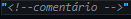

### Voltar para o [README.md](./README.md)
## índice  
> [basico](#basico)  
> [Complemento do básico](#complemento-do-básico)  
> [introdução](#introdução)  
> [Extensão da introdução](#extensões)  
> [semântica](#semântica)   
> [HTML](#HTML)  

# outros assuntos relevantes: [CSS](./CSS.md) - [JavaScript](./javascript.md)

# basico
Front-end: usa bibliotecas, frameworks, padrões de design, focando no melhor tempo de carregamento, um código de manutenção.  
> pesquisar sobre CSS e Stylus, LESS, SASS em CSS. ERB e HAML de Rails, JADE e ectjs de NodeJS e Blade de Laravel em HTML .

Back-end:conhecimento em idiomas e banco de dados.
    > pesquisar sobre ASP.NET, PHP, Python, Ruby, Node.js ( MongoDB, MySQL, PostgreSQL, Oracle e SQL Server).

### Complemento do básico:
O desenvolvedor front-end estará encarregado de colocar em prática tudo relacionado a HTML, CSS ou Javascript. Isto também inclui tendências nesta área, tais como Backbone, AngularJS, Bootstrap, Foundation e EmberJS. É seu dever manter-se atualizado sobre este tópico para oferecer os melhores resultados possíveis.

O desenvolvedor back-end, por outro lado, está mais focado no servidor de aplicações e no processamento de banco de dados. Para isto ele usa Java, Ruby,Python, PHP e .Net, entre outros, e também para a camada de dados Posgres, Oracle, MySQL/MariaDB, eMySQL. Como pode ser visto, para o desenvolvedor de back end, a manipulação de dados é um aspecto fundamental.

E finalmente, os desenvolvedores de full-stack estão em um meio termo onde têm a capacidade de lidar com ambos os tipos de desenvolvimento. Tudo isso
como uma espécie de generalista, focado no desenvolvimento de diversas habilidades que podem se adaptar a todas as camadas de um sistema. Uma contribuição para o trabalho de desempenho porque este tipo de profissional está encarregado de
visualizar tudo o que acontece com o desenvolvimento da web de uma perspectiva geral, e com conhecimento suficiente de ambos os lados para dar uma opinião valiosa.

# introdução
Home page - primeiro documento que o usuário vê ao entrar em um website.  
Página Web != website: a página web é apenas uma parte de um website, onde, a união de várias páginas web, dá surgimento a um website. Como um livro e um capítulo de livro, apenas.
> Uma divisão possível entre páginas de web, é entre as páginas web que são estáticas, e as que são dinâmicas.

    
**Site Estático**: não há interação. No máximo botões, formulários e links. A página pode ter um número fixo de páginas que não são tão complexos quanto o dinâmico. Utilização apenas de HTML e CSS.    
    *Vantagens* de custo inicial e tempo de desenvolvimento baixo comparado ao dinâmico, são mais flexíveis no design e carregam de maneira mais rápida. São pré-construídos, então não têm scripts, bancos de dados complexos também.  
    > Geradores de sites estáticos: Jekyll, GatsbyJS ou Eleventy, Headless CMS como Netlify CMS, Siteleaf ou Forestry.  
    Importante incorporação de CDN (Content Delivery Network).  
    *Desvantagens* de dificuldade ao atualizar e adicionar novas páginas e funcionalidades.  
    
    > Resumo: Opacidade a buscas dos visitantes, processo lento de atualização, usuário não pode selecionar ou modificar design, para acessar conteúdo, precisa acessar o servidor que hospeda a página.
    
**Site Dinâmico**: contém aplicações dentro do próprio site e proporciona interatividade com o navegante. Como pesquisas, votações, pedidos on-line, atendimento personalizado etc. A diferença para uma página estática multimídeia, é que aqui o conteúdo é gerado no momento da visualização. Elas são interativas e funcionais, e não apenas informativas, integrando, além do 
    HTML e do CSS, também um lado backend.  
    Diante do front-end, que é o lado do cliente, e o back-end, que é o lado do servidor, as instruções do frontend são códigos JavaScript executados no navegador. Já as do backend,são instruções em ASP.Net, PHP, Python, executadas para atender à solicitação do usuário. Após a execução, uma resposta em *HTTP* é enviada para mostrar no navegador, e o resultado sai como página HTML.  
    *Vantagens* Pode gerenciar informações através de um banco de dados, pode gerenciar conteúdo através de um CMS, pode fazer manutenções e atualizações de maneira mais barata.  
    *Desvantagens* Chance e limite de informações por conta da exibição; talvez necessida de apenas uma abordagem para todas as páginas, ao invés de vários layouts que exibem muitos conteúdos de muitas maneiras diferentes. E os custos iniciais podem ser altos.  

    > Resumo: Possibilidade de alteração de design, atualização simples, com grande número de funcionalidades e possibilidades de desenvolvimento.  

Comunicação entre navegadores ela envolve um servidor web, como IIS, Apache ou NGINX, que contém os arquivos HTML, CSS e JavaScript das páginas web, e um cliente, o navegador (Chrome, Firefox, Edge).
HTTP e HTTPS: protocolo de hypertexto e o protocolo seguro de hypertexto. A principal diferen~ça entre HTTP e HTTPS é que no último a comunicação entre o servidor e o cliente é criptografada, permitindo que os dados sejam enviados de forma segura, com maior integridade e confidencialidade.  

### Extensões:
html, e htm: Esta é geralmente a extensão padrão para páginas web estáticas, compostas de conteúdo html.  
asp (Active server pages): Estas são páginas dinâmicas que são geradas quando são visitadas. Eles são escritos em uma linguagem de programação similar à Visual Basic da Microsoft.  
jsp (Java server pages): Estas são páginas dinâmicas como as anteriores, mas são escritas na linguagem de programação Java.  
php (Personal Home Page): São páginas dinâmicas escritas com uma linguagem de uso
geral a ser embutida junto com o código HTML, que não tem nada a ver com Java ou Visual Basic.  

Apenas .html é estática, então é a única que pode ser visualizada diretamente no navegador.  
As páginas .asp, .jsp ou .php devem estar em um servidor web.  

### Semântica
Elementos Semanticos e Elementos Genéricos  
Os semânticos tem propósitos específicos, como h1, h2, h3 e tal, utilizados para propósitos específicos. Já os elementos genéricos, são os que podem ser utilizados para quase tudo o que quisermos, como o div, que cria diversas divisões para cada conteúdo, porém, por não serem semânticos, nós não sabemos para quÊ eles servem. E é sempre bom dividir o conteúdo como div's (como div de conteúdo central e div de side-bar, e tal!)  

# HTML
Série de tags que o nagevador interpreta pra exibir conteúdos na tela.  
Enquanto linguagens de programação tem capacidade de gerar fluxos de processo (como sequencial, de sequencias de instruções; condicional de capacidade de tomar decisões; e repetição, com capacidade de repetir um mesmo processo por um alto número de vezes.), O HTML não tem nenhum desses, pois é apenas uma linguagem de layout web.  

Comentários em HTML são aceitos como:  
   

 Separação em head: **metadados**, **title** da página, **links** para CSS ou JavaScript. **Base** que pode definir vias de acesso, **script** que define scripts, **style** que delimita estilos.  
 > title é a única etiqueta obrigatória dentre todas as citadas.  

 

