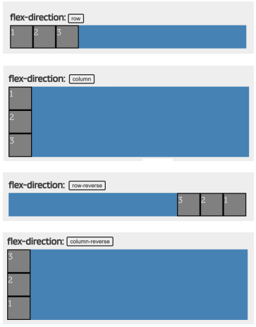
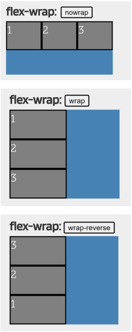

### Voltar para o [README.md](./README.md)
> índice  
> [basico](#basico)  
> [Complemento do básico](#complemento-do-básico)  
> [introdução](#introdução)  
> [Extensão da introdução](#extensões)  
> [semântica](#semântica) 
> [HTML](#HTML)  
> [CSS](#CSS)  
> [JavaScript](#javascript)

# basico
Front-end: usa bibliotecas, frameworks, padrões de design, focando no melhor tempo de carregamento, um código de manutenção.  
> pesquisar sobre CSS e Stylus, LESS, SASS em CSS. ERB e HAML de Rails, JADE e ectjs de NodeJS e Blade de Laravel em HTML .

Back-end:conhecimento em idiomas e banco de dados.
    > pesquisar sobre ASP.NET, PHP, Python, Ruby, Node.js ( MongoDB, MySQL, PostgreSQL, Oracle e SQL Server).

### Complemento do básico:
O desenvolvedor front-end estará encarregado de colocar em prática tudo relacionado a HTML, CSS ou Javascript. Isto também inclui tendências nesta área, tais como Backbone, AngularJS, Bootstrap, Foundation e EmberJS. É seu dever manter-se atualizado sobre este tópico para oferecer os melhores resultados possíveis.

O desenvolvedor back-end, por outro lado, está mais focado no servidor de aplicações e no processamento de banco de dados. Para isto ele usa Java, Ruby,Python, PHP e .Net, entre outros, e também para a camada de dados Posgres, Oracle, MySQL/MariaDB, eMySQL. Como pode ser visto, para o desenvolvedor de back end, a manipulação de dados é um aspecto fundamental.

E finalmente, os desenvolvedores de full-stack estão em um meio termo onde têm a capacidade de lidar com ambos os tipos de desenvolvimento. Tudo isso
como uma espécie de generalista, focado no desenvolvimento de diversas habilidades que podem se adaptar a todas as camadas de um sistema. Uma contribuição para o trabalho de desempenho porque este tipo de profissional está encarregado de
visualizar tudo o que acontece com o desenvolvimento da web de uma perspectiva geral, e com conhecimento suficiente de ambos os lados para dar uma opinião valiosa.

# introdução
Home page - primeiro documento que o usuário vê ao entrar em um website.  
Página Web != website: a página web é apenas uma parte de um website, onde, a união de várias páginas web, dá surgimento a um website. Como um livro e um capítulo de livro, apenas.
> Uma divisão possível entre páginas de web, é entre as páginas web que são estáticas, e as que são dinâmicas.

    
**Site Estático**: não há interação. No máximo botões, formulários e links. A página pode ter um número fixo de páginas que não são tão complexos quanto o dinâmico. Utilização apenas de HTML e CSS.    
    *Vantagens* de custo inicial e tempo de desenvolvimento baixo comparado ao dinâmico, são mais flexíveis no design e carregam de maneira mais rápida. São pré-construídos, então não têm scripts, bancos de dados complexos também.  
    > Geradores de sites estáticos: Jekyll, GatsbyJS ou Eleventy, Headless CMS como Netlify CMS, Siteleaf ou Forestry.  
    Importante incorporação de CDN (Content Delivery Network).  
    *Desvantagens* de dificuldade ao atualizar e adicionar novas páginas e funcionalidades.  
    
    > Resumo: Opacidade a buscas dos visitantes, processo lento de atualização, usuário não pode selecionar ou modificar design, para acessar conteúdo, precisa acessar o servidor que hospeda a página.
    
**Site Dinâmico**: contém aplicações dentro do próprio site e proporciona interatividade com o navegante. Como pesquisas, votações, pedidos on-line, atendimento personalizado etc. A diferença para uma página estática multimídeia, é que aqui o conteúdo é gerado no momento da visualização. Elas são interativas e funcionais, e não apenas informativas, integrando, além do 
    HTML e do CSS, também um lado backend.  
    Diante do front-end, que é o lado do cliente, e o back-end, que é o lado do servidor, as instruções do frontend são códigos JavaScript executados no navegador. Já as do backend,são instruções em ASP.Net, PHP, Python, executadas para atender à solicitação do usuário. Após a execução, uma resposta em *HTTP* é enviada para mostrar no navegador, e o resultado sai como página HTML.  
    *Vantagens* Pode gerenciar informações através de um banco de dados, pode gerenciar conteúdo através de um CMS, pode fazer manutenções e atualizações de maneira mais barata.  
    *Desvantagens* Chance e limite de informações por conta da exibição; talvez necessida de apenas uma abordagem para todas as páginas, ao invés de vários layouts que exibem muitos conteúdos de muitas maneiras diferentes. E os custos iniciais podem ser altos.  

    > Resumo: Possibilidade de alteração de design, atualização simples, com grande número de funcionalidades e possibilidades de desenvolvimento.  

Comunicação entre navegadores ela envolve um servidor web, como IIS, Apache ou NGINX, que contém os arquivos HTML, CSS e JavaScript das páginas web, e um cliente, o navegador (Chrome, Firefox, Edge).
HTTP e HTTPS: protocolo de hypertexto e o protocolo seguro de hypertexto. A principal diferen~ça entre HTTP e HTTPS é que no último a comunicação entre o servidor e o cliente é criptografada, permitindo que os dados sejam enviados de forma segura, com maior integridade e confidencialidade.  

### Extensões:
html, e htm: Esta é geralmente a extensão padrão para páginas web estáticas, compostas de conteúdo html.  
asp (Active server pages): Estas são páginas dinâmicas que são geradas quando são visitadas. Eles são escritos em uma linguagem de programação similar à Visual Basic da Microsoft.  
jsp (Java server pages): Estas são páginas dinâmicas como as anteriores, mas são escritas na linguagem de programação Java.  
php (Personal Home Page): São páginas dinâmicas escritas com uma linguagem de uso
geral a ser embutida junto com o código HTML, que não tem nada a ver com Java ou Visual Basic.  

Apenas .html é estática, então é a única que pode ser visualizada diretamente no navegador.  
As páginas .asp, .jsp ou .php devem estar em um servidor web.  

### Semântica
Elementos Semanticos e Elementos Genéricos  
Os semânticos tem propósitos específicos, como h1, h2, h3 e tal, utilizados para propósitos específicos. Já os elementos genéricos, são os que podem ser utilizados para quase tudo o que quisermos, como o div, que cria diversas divisões para cada conteúdo, porém, por não serem semânticos, nós não sabemos para quÊ eles servem. E é sempre bom dividir o conteúdo como div's (como div de conteúdo central e div de side-bar, e tal!)  

# HTML
Série de tags que o nagevador interpreta pra exibir conteúdos na tela.  
Enquanto linguagens de programação tem capacidade de gerar fluxos de processo (como sequencial, de sequencias de instruções; condicional de capacidade de tomar decisões; e repetição, com capacidade de repetir um mesmo processo por um alto número de vezes.), O HTML não tem nenhum desses, pois é apenas uma linguagem de layout web.  

Comentários em HTML são aceitos como:  
   

 Separação em head: **metadados**, **title** da página, **links** para CSS ou JavaScript. **Base** que pode definir vias de acesso, **script** que define scripts, **style** que delimita estilos.  
 > title é a única etiqueta obrigatória dentre todas as citadas.  

# CSS
Todas as etiquetas CSS são compostas por: **seletores** que determina a área a ser modificada, **instruções** que se referem às modificações aplicadas.  
    Tipos de delarações = in-line: estilo é declarado dentro da própria tag HTML;  
                interno: estilo declarado dentro de uma tag *style* criada dentro de uma head no próprio html;  
                externo: estilo é decladaro entro de um arquivo *CSS* separado, e puxado em um link para dentro do arquivo html (link rel="stylesheet" href="estilos.css").

Comentários em CSS são aceitos como:  
      

Fontes Personalizadas vêm a partir de uma propriedade @font-face com a {font-family; e o src;} que está a fonte desejada!!  
E então é só aplicar: p {font:bold 32px 'Font';} > isso fará com que a fonte **Font em Negrito** seja aplicada a todos os parágrafos da página.

### MODELO CAIXA-CONTAINER:
Etiquetas **BLOCK** (dão quebra de linha acima e abaixo de cada tag e ocupam 100% da largura da página) e **INLINE** (não tem essa quebra de linha).  
> Definidos pelo ***"display: inline" / "display: block"***  
### FLOAT, MARGIN E PADDING:
**FLOAT** altera a posição de um elemento em relação ao outro, deixando-o flutuando. Nesse caso, podemos colocar ele onde quisermos a página, e os outros elementos serão distribuídos ao redor dele. (Para que ele retorne ao normal, só usar **CLEAR**).  
**MARGIN** define o espaço entre a borda da caixa-container e o que estiver ao redor dela (em geral tela e qualquer coisa que não esteja como float, no caso).
> Definimos isso com : ***margin: 10px*** (10px de espaço em cada lado).  
> Ou utilizando "margin-top", "margin-right", "margin-bottom" e "margin-left".  

**PADDING** define o espaço entre a borda da caixa-container e o conteúdo dela.  
> Definimos isso com : ***padding: 10px*** (10px de espaço em cada.   
> Ou utilizando "padding-top", "padding-right", "padding-bottom" e "padding-left".  

**BORDER** modifica a borda de um elemento qualquer.  

### SELECIONADORES  
Definem quais elementos vão receber o estilo.  
**BLOCO DE DECLARAÇÃO** podem ir dentro da inline ou da interna, vão diretamente no *ELEMENTO* que está sendo declarado:
> p{color:#f000000}  
será aplicado à todas as tags P  

**SELETOR DE CLASSE** aplicam estilos a elementos mais especíicos, podem ir no css externo ou na head de forma interna.
> **HTML**: p class="estilop"> parágrafo 
**MAS CASO QUEiRA APLICAR ISSO EM ALGO NÃO ESPECÍFICO, É SÓ USAR SPAM:**  
spam class="estilop"> palavra </spam  

**SELETOR DE ID** aplica a um elemento específico para diferenciá-lo do resto.Cada elemento pode ter apenas UM ID e cada ID deve ser único   
> **HTML**: p id="meuestilo"> parágrafo 
 **CSS**: #meuestilo{color:#f000000}  
será aplicado apenas à tag P com o id "meuestilo"

**SELETOR DE GRUPO** aplicamos característica a etiquetass escolhidas.  
> **HTML**: p name="meuEstilo"> parágrafo 
 **CSS**: P[name="meuEstilo"] {color: white}

    ^: aplica a todos os elementos que começam com ""
> p name^="meu"> parágrafo 
 p name$="ilo"> parágrafo 
 p name*="Est"> parágrafo 
**HTML**: style type="text"> * {color: blue} </style

**SELETOR DE IRMÃOS** modifica elementos de acordo com propriedades definidas por nós.
> **HTML**: style type"text"> h1+p{color: black} </style  
será aplicado a todos os parágrafos que vem após uma h1

**SELETOR FILHO** aplica um estilo à tag que estão dentro de outras, tendo a contida como filha e a contenedora como pai
> **HTML**: style> li a {color: red} </style  
será aplicado a todos os links **a** que estão dentro de uma tag **li**  

#

> Se eu quiser estilizar apenas uma palavra ou
um grupo de palavras dentro de um texto, lembre-se
que temos que usar a tag 

#

### CORES
**PRÉ-DEFINIDAS**: digitando nome em inglês.
> p {color: blue}

**Rgb (Vermelho, Verde, Azul)**
> p {color: 42, 54, 156}

**RGB**
> p {color: #0000ek}

**RGBA**: especifica a opacidade do objeto, adicionando um número de "0.0" até "1.0".  
> #p {background-color: rgba(255, 0, 0, 0.3);}   
vermelho com transparênia de 0.3

**GRADIENTE**: deve ser aplicado a cada elemento, especificando em ordem, tipo de gradiente, direção, cor inicial e final.  
> div {backgroung: linear-gradient(to bottom, #33ccff 0%, #ff99cc 100%);}

#### ESTILOS PARA LINKS
status:
    link: exibidos apenas na página  
    visited: quando o link já foi visitado  
    hover: quando o mouse está sobre ele  
    active: quando está sendo clicado

### UNIDADES
 comprimentos absolutos:
 cm, mm, in(polegadas), px

 comprimentos relativos:
 em(tamanho da fonte e do elemento), ex(altura x da fonte atual), ch(à largura do 0), rem(ao tamanho da fonte do elemento raiz), vw(em relação à 1% da largura da janela gráfica), vh(em relação à 1% da altura da janela gráfica), vmin e vmax(1% menores/maiores do que as dimensões da janela gráfica), %(relativo ao elemento pai).

# CSS FLEXBOX
**CONTAINER**: elemento principal que está dentro de cada item, no flex as propriedades são definidas para o elemento pai.

**EIXO PRINCIPAL**: orientação principal, deve ser específica (normalmente é horizontal).

**EIXO SECUNDÁRIO**: os containers flexíveis tem uma orientação perpendicular à principal, então se o eixo principal tá no horizontal, esse aqui vai estar como vertical.

**ITEM**: o item filho que está dentro do container.

### FLEX E WRAP 
 é definido pela propriedade "display" e pode se comportar de forma **INLINE-FLEX** (semelhante à inline-block, deixa em linha, ocupando apenas o conteúdo) e **FLEX** (deixa em bloco, semelhante à block, ocupando toda a largura do pai).

Para definir a direção do eixo, a gente usa **FLEX-DIRECTION** (valores **ROW** que define do eito principal para horizontal, **ROW-REVERSE** que define para horizontal invertido, **COLUMN** que define para vertical, **COLUMN-REVERSE** que define para vertical invertido).

> 

E para epecificar se o container pode "transbordar" o conteúdo, utilizamos **FLEX-WRAP** (valores **NOWRAP** para impedir essas multilinhas e usar uma linha só, **WRAP** pra permitir esse modo, **WRAP-REVERSE** para deixar transbordar, mas na direção inversa).

> tem também a flex-flow que resume tudo em uma unidade só (tipo *"row wrap"*)

### ALINHAMENTO
**JUSTIFY-CONTENT**: alinha os itens no eixo principal, horizontal.
**ALIGN-CONTENT**: os align são usados em casos de container multilinhas, para alinhar cada uma delas (com o flex-wrap).
**ALIGN-ITEMS**: alinha os items no eixo vertical, ou secundário. 
**ALIGN-SELF**: deixa um item específico ter um comportamento diferente do resto, quando usamos **align-items**.

 **START** (deixa no inicio) **END** (agrupa tudo no final) **CENTER** (deixa tudo no centro) **SPACE-BETWEEN** (distribui os itens com bastante espaço entre eles) **SPACE-AROUND** (distribui e deixa o mesmo espaço entre cada item) **SPACE-EVENLY** (distribui deixando o mesmo espaço entre direita e esquerda) **STRETCH** (estica tudo pra ocupar todo o espaço) **BASELINE** (alin com base no conteúdo interno) **AUTO** (herda o valor do align-items ja definido, *padrão = stretch*).

 > != JUSTIFY E ALIGN CONTENT: align é pra casos multilinha, cuidando de cada linha.  
 > != ALIGN CONTENT E ITEMS: content é mais geral e items se define a como eles vão se comportar.  

 > exemplos nas páginas 10-13: https://courses.skillsbuild.skillsnetwork.site/assets/courseware/v1/bf2ac5095c435df21f0fff874358e754/asset-v1:BeJob+Slv5vS+v1+type@asset+block/Python_Tema4_Parte5_BR_v1.pdf

> atalho: junta align-content e justify-content = place-content  
>   {place-content: flex-start flex-end;}  
> = {align-content: flex-start; justify-content: flex-end;} 

**propriedade dos filhos**: aplicam-se apenas aos items filhos.  

# JAVASCRIPT

